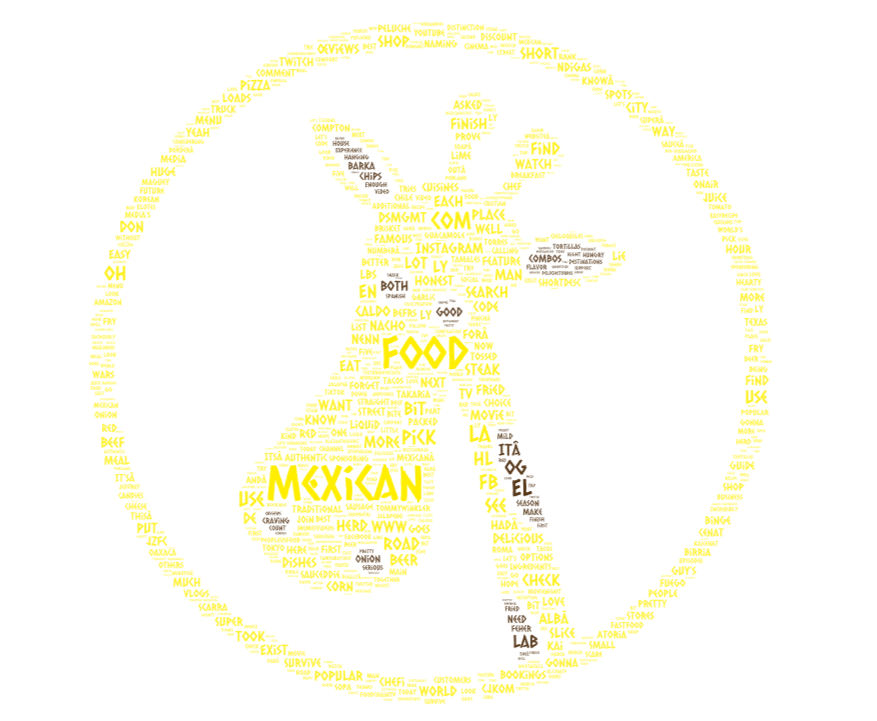
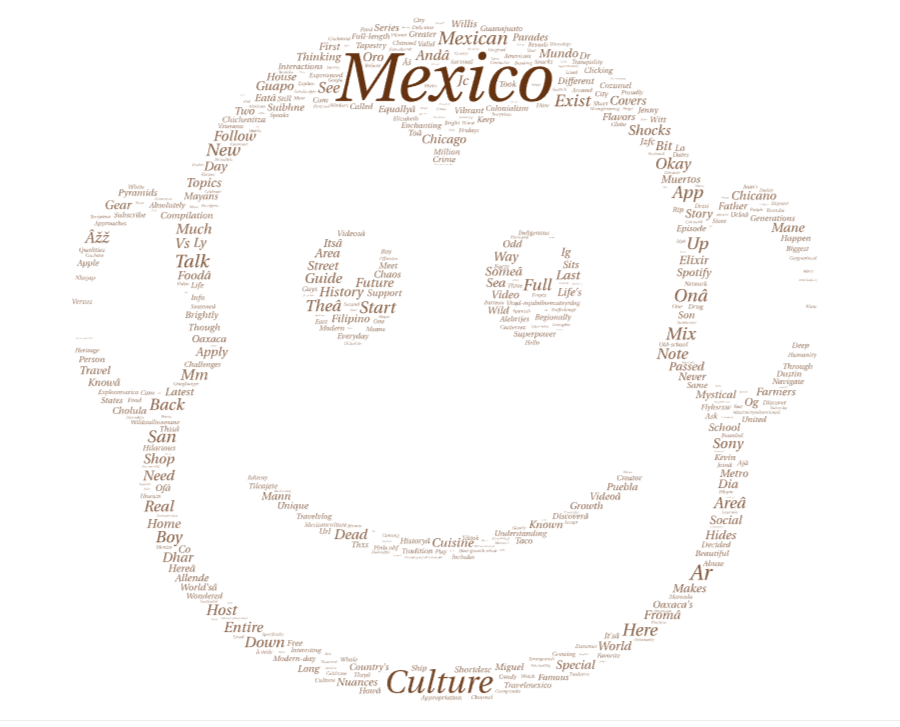

# World Cloud Project

## Introduction
I chose to examine the worldclouds that would be generated from the youtube search topics, Mexican Culture and Mexican Food. I am Mexican and have been around these topics for my entire life so I was curious to see what the general video topics would be made around the subject. My thinking being that from the video metadata we would be able to gather what the general consensus is around these topics. If people were big fans of Mexican food then the wordcloud would show that from the biggest words. And from the Mexican culture wordcloud we should be able to see what big traditions are mentioned throughout the videos, and any features of those traditions.

[Download the Mexican Food Word Cloud](img/mexican_food.png)

[Download the Mexican Culture Word Cloud](img/mexican_culture.png)

## Data Cleaning Observations
One of the first things I was suprised to see from the csv's was a bunch of mentions of social media handles, everything from Instagram, to Facebook, to TikTok, mentioned enough that if I didn't clear them from the table they would've been one of the biggest mentions. Looking back I definitely should've removed the parts of the Youtube scraper that was taking the channel names and anything that was not really relevant like hashtags and the word subscribe. I would like to mention that I did actually remove a bunch of irrelevant terms from the csv but there were so many that I would actually be left with nothing in the culture wordcloud if I erased them all.

## Mexican Food Word Cloud Results
From the Mexican food word cloud I go the results I was expecting, the biggest terms were Mexican and Food, followed by decriptors that paint the way the videos depict Mexican food. Some of the main descriptors included the words:

- good  
- chips  
- craving  
- onion  
- beef  

## Mexican Culture Word Cloud Results
The word cloud for the Mexican culture word cloud had slightly different results from what I was expecting. With a good portion of the raw data including things like programs to learn spanish, subscriptions, and other language learning services that the video creators were trying to push on the viewers. There really wasn't many words that I would assosciate with Mexican culture in general. It was mostly seemingly random words instead of names of traditions or locations which were actually some of the smallest words in the cloud.

## Interpretation
My guess as to why this was the case for the culture search but not the food search is because chances are the people who are actively searching for Mexican Culture are the ones who are trying to travel to the country or learn the language for one reason or another. They wouldn't list places in the titles because the people who are watching the videos don't know any places, they are watching the video to learn. And the food one actually includes the relevant terms because its either people wanting to learn how to cook a specific dish or they just want to know more about a specific food.
